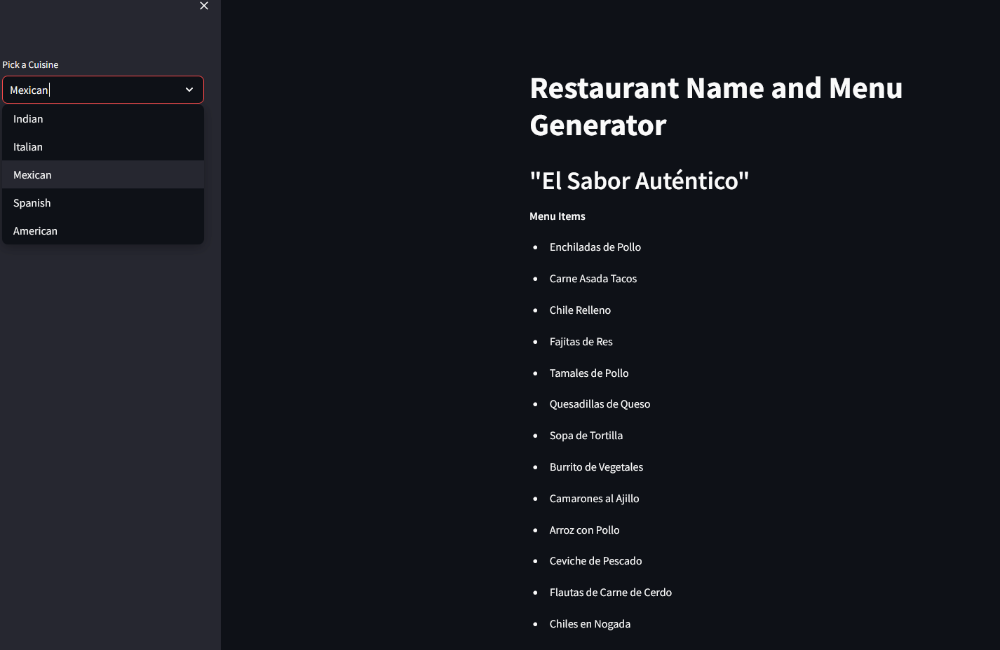

Tiny project to serve as an introduction to langchain and the use of LLMs, that originates from [codebasics tutorial](!https://www.youtube.com/watch?v=d4yCWBGFCEs&list=RDCMUCh9nVJoWXmFb7sLApWGcLPQ&start_radio=1&ab_channel=codebasics). Code differs due to significant changes in langchain library.

Set-up:

Install requirements.txt
Create a python file called secret_key.py with the following variable:
- open_ai_key = 'FILL WITH YOUR OPEN AI KEY'.

Comand to run the streamlit: 

> streamlit run main.py

Expected result:

